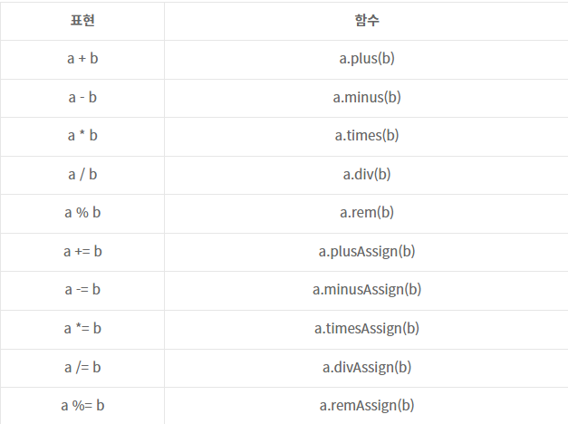

## lec04. 연산자

1. `단항 연산자(++,--), 산술연산자(+,-,*, 등.)` Java와 동일
2. `비교 연산자(>, <)` Java와 동일
```java
public class JavaMoney implements Comparable<JavaMoney> {
  private final long amount;

  public JavaMoney(long amount) {
    this.amount = amount;
  }

  // 주어진 수 기준,
  // 크면(>) 음수
  // 작으면(<) 양수
  // 같으면(==) 0
  @Override
  public int compareTo(@NotNull JavaMoney javaMoney) {
    return Long.compare(this.amount, o.amount);
  }
}

  public static void main(String[] args) {
    JavaMoney money1 = new JavaMoney(2000L);
    JavaMoney money2 = new JavaMoney(1000L);

    if (money1.compareTo(money2) > 0) {
      System.out.println("money1이 money2보다 금액이 큽니다.");
    }
  }
```
```kotlin
fun main(){

  val money1 = JavaMoney(2000L)
  val money2 = JavaMoney(1000L)

  if (money1 > money2) {
      println("money1이 money2보다 금액이 큽니다.");
  }
}
```
- Java와는 다르게 객체를 비교할때, 비교 연산자를 사용하면, 자동으로 `compareTo`를 호출해줍니다.
- compareTo를 구현해줄 필요가 없다. ( 자바로 구현할때, 항상 헷갈려서 구글링 했던 기억이.. )

### 비교연산자와 동등성, 동일성
* `동일성(Identity)`: 완전히 동일한 객체인가?! 즉, 주소가 같은가??
* `동등성(Equality)`: 두 객체의 값이 같은가

- Java   기준 동일성 `==`  / 동등성 `equals`
- Kotlin 기준 동일성 `===` / 동등성 `==`호출한다.
    - `==`을 사용하면 간접적으로 `equals`를 호출해준다.

```Java
  public static void main(String[] args) {
    JavaMoney money1 = new JavaMoney(1000L);
    JavaMoney money2 = money1;
    JavaMoney money3 = new JavaMoney(1000L);
    
    sout(money1 == money2);     // true
    sout(money1 == money3);     // false
  }
```

```kotlin
fun main(){
    val money1 = JavaMoney(1000L)
    val money2 = money1
    val money3 = JavaMoney(1000L)
  
    println(money1 === money2) // true
    println(money1 === money3) // false
  
  
  fun fun1( )
}
```

### 논리연산자( &&, ||, ! )
- 자바와 완전히 동일


### 특이한 연산자

#### in, !in
- 컬렉션이나 범위에 포함되어 있다, 포함되어있지 않다.
```kotlin
println (1 in numbers)
```

#### a..b
- a부터 b까지의 범위 객체를 생성한다.


### 연산자 오버로딩
- 코틀린에서는 객체마다 연산자를 직접 정의할 수 있다.
```java
public class JavaMoney implements Comparable<JavaMoney> {
  private final long amount;

  public JavaMoney(long amount) {
    this.amount = amount;
  }

  /**
   * @param other
   * @return
   */
  public JavaMoney plus(JavaMoney other) {
    return new JavaMoney(this.amount + other.amount);
  }

  // 주어진 수 기준,
  // 크면(>) 음수
  // 작으면(<) 양수
  // 같으면(==) 0
  @Override
  public int compareTo(@NotNull JavaMoney javaMoney) {
    return Long.compare(this.amount, o.amount);
  }
  
  @..toString();
  
  @..hashCode();
  
  @..eqauls();
}

  public static void main(String[] args) {
    JavaMoney money1 = new JavaMoney(2000L);
    JavaMoney money2 = new JavaMoney(1000L);
    
    // JavaMoney{amount=3000}
    System.out.println(money1.plus(money2));
  }
```
```kotlin
data class Money(
  val amount: Long
){
    operator fun plus(other: Money): Money{
      return Money(this.amount + other.amount)
    }
}


fun main(){
  val money1 = Money(1000L)
  val money2 = Money(2000L)

  // Money(amount=3000)
  println(money1 + money2)
}
```
### operation 연산 종류 




### 정리
- 단항연산자, 산술연산자, 산술대입연산자, 비교연산자 JAVA와 같다.
    - 단 객체끼리 비교 시점에 CompareTo가 자동으로 사용되어 비교연산자를 수행할수 있다.
- in, !in / a..b / a[i] / a[i] = b와 같이 코틀린에서 새로 생긴 연산자도 있다.
- 객체끼리의 연산자를 코틀린에서는 직접 정의할 수 있다.
