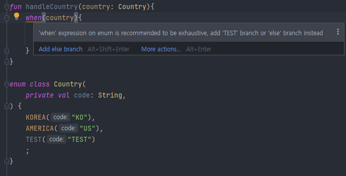

## lec14. 다양한 클래스 다루는 방법
### Data Class
```java
public class JavaPersonDto {
  private final String name;
  private final int age;

  public JavaPersonDto(String name, int age) {
    this.name = name;
    this.age = age;
  }

  public String getName() {
    return name;
  }

  public int getAge() {
    return age;
  }

  @Override
  public boolean equals(Object o) {
    if (this == o) return true;
    if (o == null || getClass() != o.getClass()) return false;
    JavaPersonDto that = (JavaPersonDto) o;
    return age == that.age && Objects.equals(name, that.name);
  }

  @Override
  public int hashCode() {
    return Objects.hash(name, age);
  }

  @Override
  public String toString() {
    return "JavaPersonDto{" +
            "name='" + name + '\'' +
            ", age=" + age +
            '}';
  }
}

```
- 계층간의 데이터를 전달하기 위한 `DTO(Data Transfer Object)`
- `IDE`를 활용하거나, `Lombok`을 활용할 수도 있지만, 클래스가 장황해지거나, 클래스 생성 이후 추가적인 처리를 해줘야 하는 단점이있다.

```kotlin
data class PersonDTO(
  val name: String,
  val age: Int,
)
```
- `equals, hashcode, toString, getter, setter`를 자동으로 생성해준다.
- 여기에 `named argument`까지 활용하면, `builder pattern`을 쓰는 것 같은 효과도 있습니다!


### Enum Class
```java
public enum JavaCountry {
    KOREA("KO");
    AMERICA("US");
    
    private final String code;

    JavaCountry(String code) { this.code = code; }
    
    public String getCode() { return code; }
}
```
- 추가적인 클래스를 상속받을 수 없다.
- 인터페이스는 구현할 수 있으며, 각 코드가 싱글톤이다.
```kotlin
fun handleCountry(country: Country){
    when(country){
        Country.KOREA -> TODO()
        Country.AMERICA -> TODO()
    }
}

enum class Country(
  private val code: String
) {
  KOREA("KO"),
  AMERICA("US"),
  ;
}
```
- `when`은 `Enum Class, Sealed Class`와 함께 사용할 경우 더욱더 진가를 발휘한다.!!
- 컴파일러가 country의 모든 타입을 알고 있어, 다른 타입에 대한 로직(else)를 작성하지 않아도 된다.
- Enum의 변화가 있으면 알수 있다.
- 

### Sealed Class, Sealed Interface
#### 개요
- 상속이 가능하도록 추상클래스를 만들까 하는데..
- 외부에서는 이 클래스를 상속받지 않았으면 좋겠어!!
- 그러면, 하위 클래스를 봉인하자!!
  <br>
#### 사전적 정의
- 컴파일 시점에 하위 클래스의 타입을 모두 기억한다.
- 즉, 런타임때 클래스 타입이 추가될 수 없다.
- 하위 클래스는 같은 패키지에 있어야 한다.
- `Enum`과 다른점
    - 클래스를 상속받을수 있다.
    - 하위 클래스는 멀티 인스턴스(`Enum은 싱글톤`)가 가능하다.

```kotlin
sealed class HyundaiCar(
  val name: String,
  val price: Long
)

class Avante : HyundaiCar("아반떼", 1000L)

class Sonata : HyundaiCar("소나타", 2000L)

class Grandeur : HyundaiCar("그랜저", 3000L)
```
- **추상 클래스와 다른점은 컴파일 타임 때 하위 클래스의 타입을 모두 기억**한다.
- 즉, 런타임때 클래스 타입이 추가될 수 없다.

